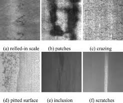
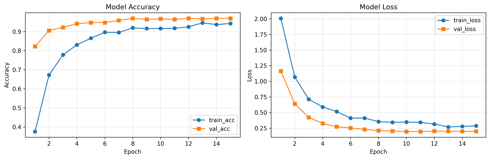
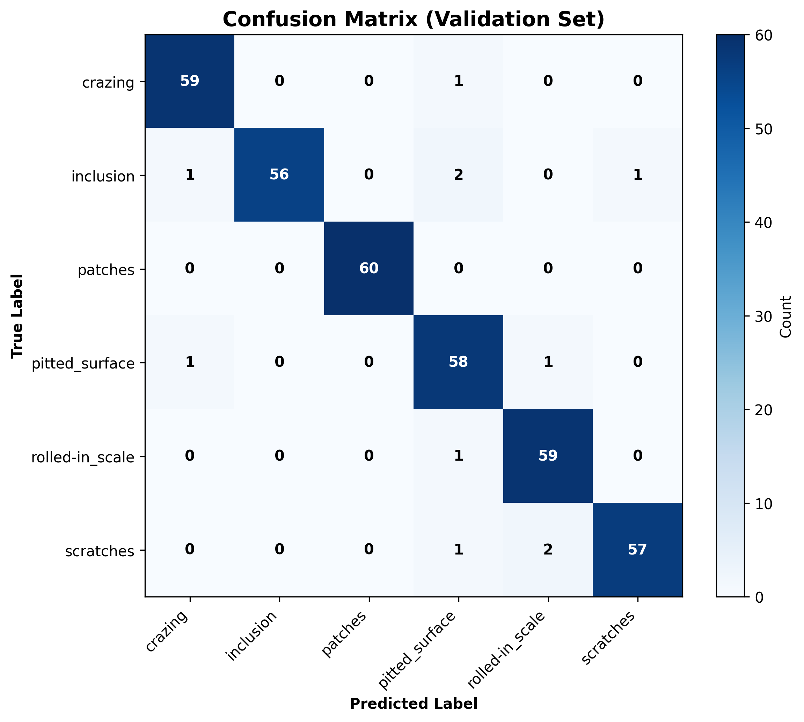
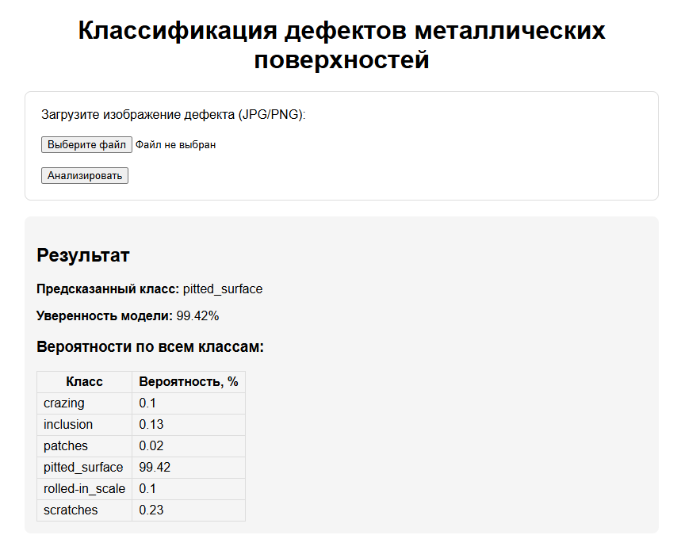
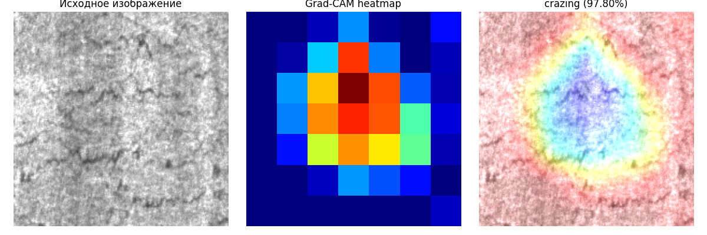

# CV Defect Classifier 🔍

Веб-приложение на Flask для классификации дефектов поверхности металла с использованием глубокого обучения. Приложение использует обученную модель ResNet50V2 для детектирования и классификации различных типов дефектов на промышленных поверхностях.

---

## ✨ Возможности

- 🎯 **Быстрая классификация** дефектов на загруженных изображениях
- 📊 **Вероятность предсказания** для каждого класса
- 🌐 **Веб-интерфейс** для простого использования
- 🚀 **REST API** для интеграции с другими системами
- 📦 **Docker поддержка** для развертывания в контейнерах
- 🎨 **Адаптивный дизайн** (мобильно-дружелюбный интерфейс)

---

## 📋 Требования

- Flask==3.1.3
- tensorflow-cpu==2.13.0
- Pillow
- numpy
- gunicorn
- matplotlib
- scikit-learn
- opencv-python

---

## Датасет

**NEU Surface Defects dataset**:
- kaggle: https://www.kaggle.com/datasets/kaustubhdikshit/neu-surface-defect-database


---

## Структура проекта


```
datasets/
├── train/
│   └── images/
│       ├── crazing/
│       ├── inclusion/
│       ├── patches/
│       ├── pitted_surface/
│       ├── rolled-in_scale/
│       └── scratches/
└── validation/
    └── images/
        ├── crazing/
        ├── inclusion/
        ├── patches/
        ├── pitted_surface/
        ├── rolled-in_scale/
        └── scratches/
```


## Установка

#### 1. Клонируйте репозиторий

```bash
cd c:\Users\kdyus\Documents\CV-Defect-Classifie
```

#### 2. Создайте виртуальную среду

```powershell
py -3.11 -m venv .venv
```

#### 3. Активируйте виртуальную среду

```powershell
# Windows
.\.venv\Scripts\Activate

# Linux/Mac
source .venv/bin/activate
```

#### 4. Установите зависимости

```bash
pip install -r requirements.txt
```


#### 5. Обучите модель

```bash
python -m training.train_neu_model
```

Это создаст:
- ✅ Обученную модель: `app/models/neu_best_finetuned.keras`
- ✅ Список классов: `app/models/class_names.txt`
- ✅ Графики и метрики в папке `training/results/`

---

## 🎯 Использование

### Запуск веб-приложения

```powershell
# Вариант 1 (рекомендуется)
python -m flask run

# Вариант 2
$env:FLASK_APP = "app.app"
flask run

# Вариант 3
python -m app.app
```

Приложение будет доступно по адресу: **http://localhost:5000**

### Использование через веб-интерфейс

1. Откройте http://localhost:5000 в браузере
2. Загрузите изображение с дефектом (PNG, JPG, BMP)
3. Нажмите кнопку отправки
4. Получите результаты классификации с вероятностями

### REST API

```bash
# Загрузить изображение и получить предсказание
curl -X POST -F "file=@image.jpg" http://localhost:5000/api/predict
```

**Пример ответа:**

```json
{
  "predicted_class": "Scratch",
  "confidence": 0.95,
  "probabilities": {
    "Crack": 0.02,
    "Inclusion": 0.01,
    "Pitting": 0.01,
    "Rolling": 0.01,
    "Scratch": 0.95
  }
}
```

---


## 🐳 Развертывание с Docker

#### Сборка образа

```bash
docker build -t cv-defect-classifier .
```

#### Запуск контейнера

```bash
docker run -p 5000:5000 cv-defect-classifier
```

Приложение будет доступно на http://localhost:5000

---

## 🤖 Модель и обучение

Проект использует **ResNet50V2** с трансфер-лернингом, предобученная на ImageNet и дообученная на **NEU Surface Defects** датасете.

### Классы дефектов (6 типов):
- **Crazing** — сетка трещин
- **Inclusion** — включения посторонних частиц
- **Patches** — пятна и образования
- **Pitted Surface** — точечная коррозия
- **Rolled-in Scale** — окалина
- **Scratches** — царапины

Пример из датасета:



### Архитектура модели:
```
ResNet50V2 (предобученная)  [23.5М параметров, frozen]
    ↓
Global Average Pooling2D
    ↓
Dense(512, ReLU) + BatchNorm + Dropout(0.6) [L2 регуляризация]
    ↓
Dense(256, ReLU) + BatchNorm + Dropout(0.5) [L2 регуляризация]
    ↓
Dense(6, Softmax) [выходной слой]
```

### Параметры обучения:
- **Размер изображения:** 200×200 пиксели
- **Batch size:** 16
- **Max Epochs:** 30
- **Optimizer:** Adam (lr=1e-4, weight_decay=1e-5)
- **Loss:** Categorical Crossentropy
- **Callback:** EarlyStopping (patience=7, monitor=val_accuracy)

### Техники регуляризации (предотвращение переобучения):
- ✅ **Data Augmentation:** поворот (±20°), сдвиг (±20%), масштабирование (±20%), горизонтальный флип
- ✅ **L2 Regularization:** коэффициент 1e-4
- ✅ **Batch Normalization:** нормализация между слоями
- ✅ **Dropout:** 0.5-0.6 для регуляризации
- ✅ **Weight Decay:** 1e-5 в оптимизаторе

---

## 📊 Метрики и результаты обучения

### Сохраняемые результаты

После завершения обучения в папке `training/results/` сохраняются: 
1. графики во время обучения:
- Accuracy (train vs validation)
- Loss (train vs validation)
- кол-во эпох

Пример графика:



2. Матрица ошибок классификации:
- показывает правильные и неправильные предсказания
- по диагонали — правильные предсказания
- вне диагонали — ошибки

Пример матрицы:



3. Детальный отчет с метриками:
- **Precision:** доля верных предсказаний среди всех предсказанного класса
- **Recall:** доля верно предсказанных примеров класса
- **F1-score:** гармоническое среднее точности и полноты
- **Support:** количество примеров класса в тестовом наборе

<details>
<summary>📋 Пример classification_report.txt</summary>

```
============================================================
CLASSIFICATION REPORT (VALIDATION SET)
============================================================
              precision    recall  f1-score   support

     crazing       0.98      0.98      0.98        60
   inclusion       0.99      0.99      0.99        60
     patches       0.97      0.98      0.97        60
pitted_surface     0.98      0.98      0.98        60
rolled-in_scale    0.99      0.98      0.99        60
    scratches      0.99      0.99      0.99        60

    accuracy                           0.98       360
   macro avg       0.98      0.98      0.98       360
weighted avg       0.98      0.98      0.98       360
```

</details>


---
### Типичные результаты

На NEU Surface Defects датасете после обучения получаются:
- **Validation Accuracy:** ~98-99%
- **Validation Loss:** ~0.08
- **Per-class F1-score:** 0.97-0.99


Пример результата:

---

## 🎨 Grad-CAM визуализация (Объяснимость модели)

**Grad-CAM** показывает, какие области изображения модель использует при предсказании.

### Запуск визуализации

```powershell
python -m training.grad_cam_demo
```

Скрипт автоматически:
- Загружает обученную модель из `app/models/`
- Находит первое изображение из валидационного набора
- Генерирует три изображения:
  1. **Исходное изображение** — оригинальное фото дефекта
  2. **Heatmap** — тепловая карта внимания (красный=высокое внимание)
  3. **Наложение** — Grad-CAM поверх оригинала

Пример GRAD Cam:


### Как интерпретировать результаты

- 🔴 **Красные/жёлтые области** — модель сосредоточена здесь при предсказании
- 🔵 **Синие области** — модель игнорирует эти части
- ✅ Хороший результат: модель выделяет именно область дефекта

### Примеры использования

Отредактируйте последнюю строку файла `training/grad_cam_demo.py`, чтобы выбрать конкретное изображение:

```python
# Вместо автоматического поиска, укажите путь:
show_gradcam(r"datasets/validation/images/scratches/scratches_123.jpg")
```


---

## � Примеры и демонстрация

### Обучить модель с нуля

```powershell
# 1. Подготовить датасет (см. разделы выше)
# 2. Активировать виртуальную среду
.venv\Scripts\Activate

# 3. Запустить обучение
python -m training.train_neu_model
# Займет ~10-15 минут на CPU, 2-3 минуты на GPU
```

### Протестировать модель на примерах

```powershell
# Запустить Grad-CAM визуализацию
python -m training.grad_cam_demo

# Или запустить веб-приложение и загружать изображения вручную
python -m flask run
```

### Интегрировать в свой проект

```python
from app.model_utils import predict_defect
from werkzeug.datastructures import FileStorage

# Файл из flask request
file = request.files['file']

# Предсказание
predict_class, confidence, probs = predict_defect(file)
print(f"Дефект: {predict_class}, уверенность: {confidence:.2%}")
```


---


**Сделано с ❤️ для классификации дефектов поверхности промышленного оборудования**

*Последнее обновление: март 2026*

**Версия проекта:** 1.1.0 (Updated с улучшениями обучения и визуализацией)